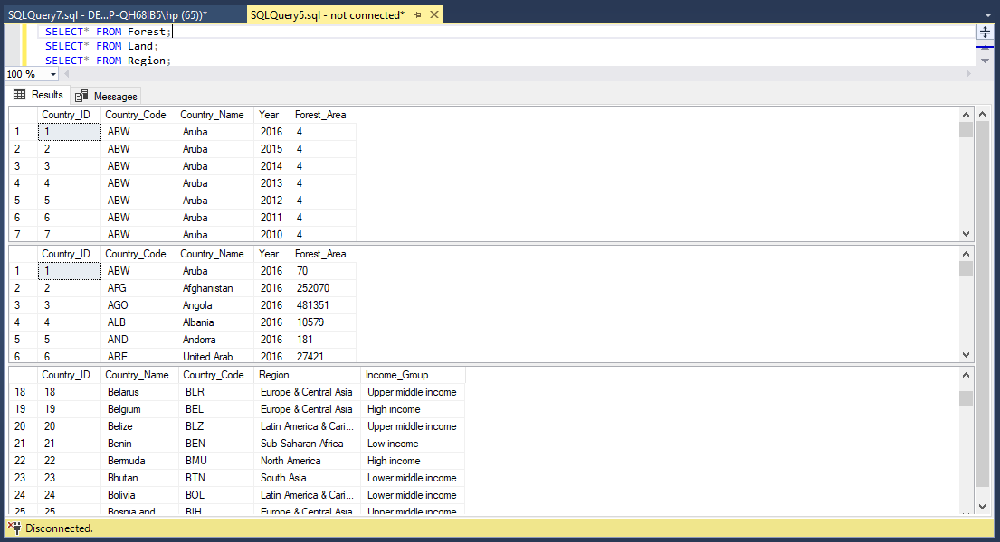
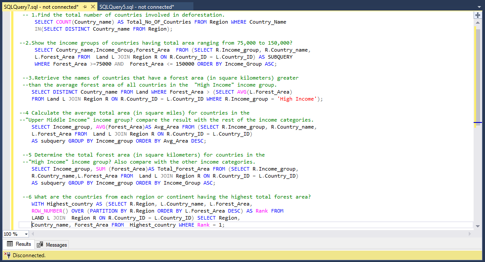
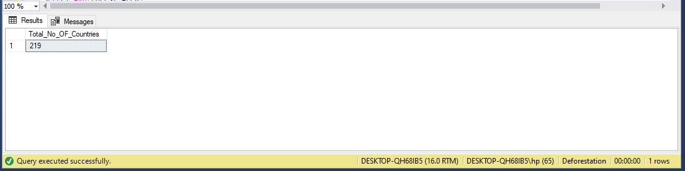
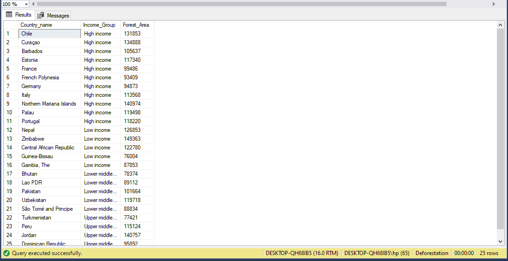
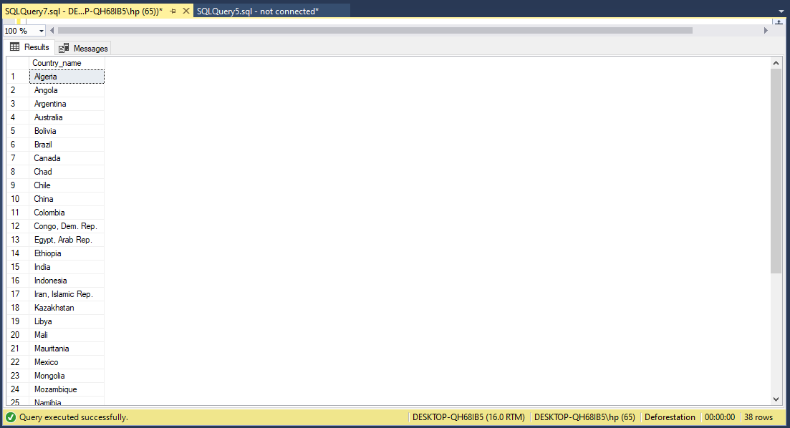
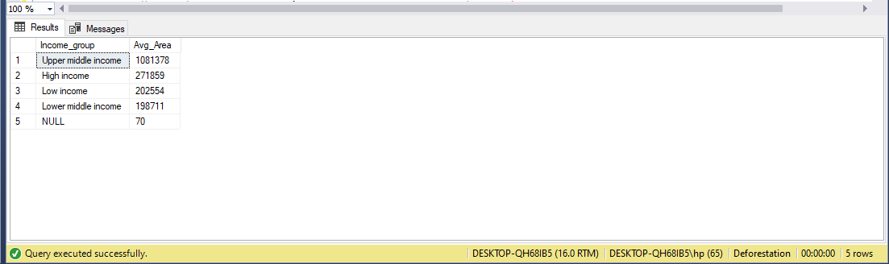
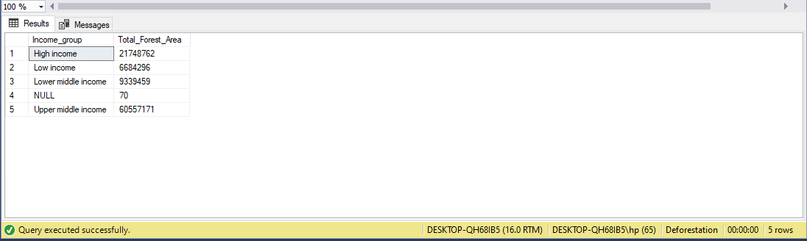
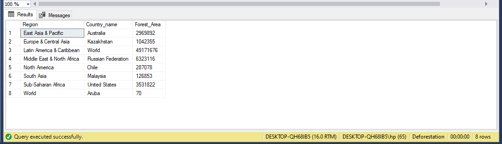

# SQL_PROJECT
# SQL Project Completion 🌟
This repository contains the culmination of my **SQL journey**, showcasing the skills and knowledge I've gained throughout my **SQL class**. The project focuses on retrieving and analyzing data related to **deforestation** across different **countries** and **continents** of the world and income groups. By utilizing **SQL queries**, I've explored data relationships, calculated averages, and compared metrics across different income groups. This project reflects my **proficiency in SQL** and my ability to manipulate data effectively. Feel free to explore the queries and insights generated as I delve into the world of structured data analysis.
The project was carried out at the end of the SQL class. 
The following questions were raised to guide the project:
1.	Find the total number of countries involved in deforestation. 
2.	Show the income groups of countries having total area ranging from 75,000 to 150,000?
3.	Retrieve the names of countries that have a forest area (in square kilometers) greater than the average forest area of all countries in the "High Income" income group.
4.	Calculate the average total area (in square miles) for countries in the "Upper Middle Income" income group? 
    compare the result with the rest of the income categories.            
5.	Determine the total forest area (in square kilometers) for countries in the "High Income" income group? Also, compared with the other income categories. 
6.	What are the countries from each region or continent having the highest total forest area?
   #  A View Of The Tables In The DataSet

# Data Cleaning
The dataset for this project was in **CSV** files so I opened them in **Excel** for cross-examination. I cleaned the data of duplicates and blank spaces and renamed a few columns to reflect their contents. Also, the data types were changed as well to the appropriate datatype e.g. Date for Date column, and so on. It was observed that none of the columns had unique values so I had to add a column titled customer ID this is important while assigning **primary keys in SQL**. 
# Skills Involved
1. Use of **COMMON TABLE EXPRESSION**
2. Use of **GROUP BY CLAUSE**
3. Use of **ORDER BY**
4. Use of ***SELECT**
5. Use of **RANK**
6. Use of **ROW**
7. Use of **COUNT**
8. Use of **SELECT DISTINCT**
9. Use of **WHERE CLAUSE**
10. Use of **AND OPERATOR**
11. Use of **JOIN CLAUSE** 
12. Use of **IN OPERATOR**
13. Use of **AVG FUNCTION**
14. Use of **SUM FUNCTION**
15. Use of **LESS THAN** <
16. Use of **GREATER THAN** >
# Sets Of Codes

# Procedures In The Analysis
To calculate the total number of countries involved in deforestation, I use the **SELECT DISTINCT** clause to retrieve the country names from the **Region table** to ensure no duplicates, before obtaining the total number of countries using the **COUNT FUNCTION** renaming the column **AS Total No. Of Countries.**

To show the income group of countries having a total area ranging from **75,000 to 150,000,** I **JOINED** the **Region and Land tables** **AS SUBQUERY** using their common column “customer ID so I can get the required columns together. 
Then I retrieved the Country name, Income group, and Forest Area **WHERE** the Forest Area is **GREATER THAN OR EQUAL TO** 75,000 **AND LESS THAN OR EQUAL TO** 150,000.

I retrieved the countries with greater forest area than the average of the “High Income” by **JOINING** the **Land and Region tables** using their common column ID. Then I found the average  Forest area restricting it to **WHERE** the income group was “High Income”. Then I used the **SELECT DISTINCT** to retrieve the country's name without a duplicate.

For the next question, again I **JOINED** the **Land and Region tables** **AS SUBQUERY**, got the average of Forest Area using the **AVERAGE FUNCTION**, **SELECTED** the income group, and **GROUPED BY** income group, and **ORDERED BY** Avg Area to ensure Upper Middle Income” is at the top of the column.

To answer this question, once again I **JOINED** the two tables and added the Forest Area values with the **SUM FUNCTION** and **SELECTED** the income group column. The I **GROUPED BY** income group and sorted(ORDER BY) by the same column in **ASCENDING** (ASC) order.

Lastly, to indicate the countries from each region/continent with the highest total forest area, I **JOINED** the **Land and Region tables** ”. The **WITH** statement was used to define the **HIGHEST COUNTRY table**. **ROW FUNCTION** was used to assign unique values to the countries and **PARTITIONED BY** Regions, sorted (ORDER BY) in **DESCENDING** (DESC) order. The three columns, Region, country name, and Forest Area were retrieved from the **HIGHEST COUNTRY  table** which(WHERE CLAUSE) had a **RANK** of 1.

# Summary Conclusion 🔍

In completing this **SQL project**, I've successfully harnessed the power of **SQL** to analyze and extract meaningful insights from complex datasets. Through meticulous querying, I've explored the relationships between forest areas and income groups, shedding light on countries' ecological landscapes and economic standings. By calculating averages and making comparisons, I've revealed patterns that enrich our understanding of these intertwined factors.
This project has honed my ability to structure and execute intricate **SQL queries**, showcasing my proficiency in data manipulation and analysis. As I've navigated through the project's challenges, I've not only advanced my technical skills but also developed a deeper appreciation for the role data plays in unveiling hidden narratives.
Through this journey, I've come to appreciate **SQL's prowess** in transforming raw data into actionable insights. The project's outcomes not only stand as a testament to my **SQL proficiency** but also exemplify the power of structured querying in making sense of complex datasets.
*Thanks for reading, you may want to consider reading my other projects and tasks in Excel and SQL*. 

